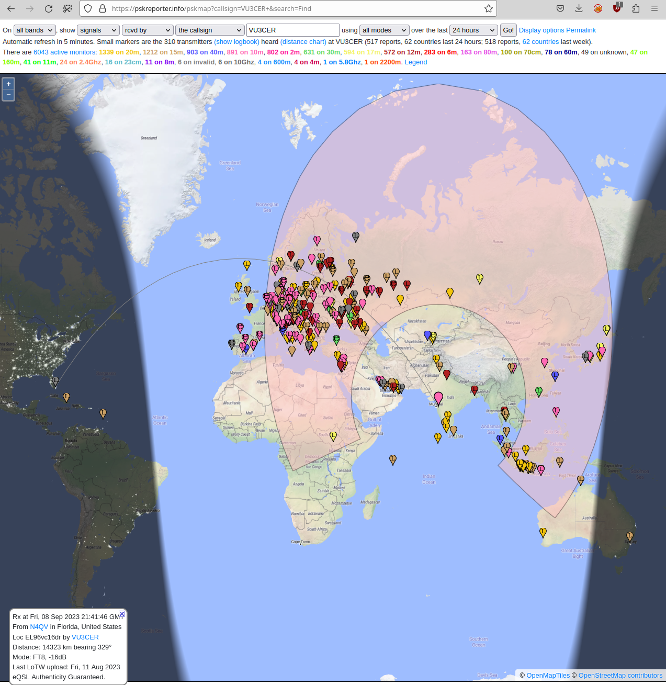

# Easy-DigiSkimmer

This rough is pretty rough at the moment - you have been warned ;)

Note: The borrowed code uses `GPL v2` license. My code is under
non-commercial-usage "license". No warranty nor free support as usual.

Combination of following projects:

- https://github.com/kholia/ConsensusBasedTimeSync/tree/master/CD2003-BoB-v2

- https://github.com/kholia/Si5351-Pi-Pico

- https://github.com/kholia/Si5351-Module-Clone-TCXO/

BOM:

* Raspberry Pi Zero 2 W - 1850 INR

* CD2003 receiver system - 200 INR

* Si5351 TCXO module - 300 INR

* Raspberry Pi Pico - 350 INR

* Best quality jumpers (~10 NOS) - 150 INR

Total: ~ 2900 INR.

Extra BOM:

* 50W Solar Panel - 3100 INR

* https://www.waveshare.com/wiki/Solar_Power_Manager_(C) - 1800 INR

## Credits

https://github.com/lazywalker/DigiSkimmer


## Pics



## Tips

Spectrogram via CLI!

```
sox 45.wav -n spectrogram
```

## DietPi Setup Notes

```
apt-get install alsa-utils libqt5core5a libgfortran5 openssh-client libfftw3-single3

apt-get install libnewlib-dev libnewlib-dev libnewlib-arm-none-eabi

apt-get install aptitude vim git

apt install build-essential pkg-config libusb-1.0-0-dev cmake

apt-get install cmake build-essential make gcc-arm-none-eabi binutils-arm-none-eabi libnewlib-arm-none-eabi
```

## Recommended Gear

- ROCCAT Juke USB soundcard

- Creative Sound Blaster PLAY! 3 USB soundcard
